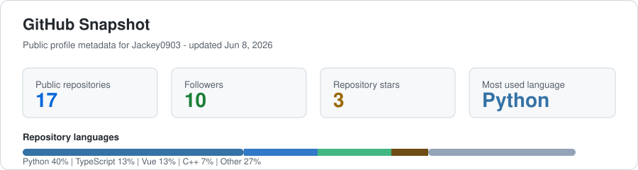

# Haojie Hu

**Software Engineering Undergraduate @ Tongji University**

Multimodal Perception | Audio-Visual Understanding | LLM Reasoning | Model Interpretability | AI for Research

[GitHub](https://github.com/Jackey0903) | [Tongji University](https://www.tongji.edu.cn/) | [Profile Repository](https://github.com/Jackey0903/Jackey0903)

---

## About

I am an undergraduate student in Software Engineering at Tongji University. My current work focuses on multimodal perception and model reasoning, with an emphasis on how systems combine visual, audio, motion, and textual evidence under practical task constraints.

## Research Interests

| Direction | Questions I care about |
| --- | --- |
| Multimodal learning | How can models ground objects, events, and actions across audio, vision, motion, and language? |
| Audio-visual perception | How can temporal and motion cues reduce static visual bias in segmentation and understanding tasks? |
| LLM reasoning | When should a model spend more reasoning budget, and how can that decision be measured or routed? |
| Interpretability | Which internal features explain reasoning behavior, budget sensitivity, and failure modes? |
| AI for research | How can generation, checking, revision, and rendering loops support scientific communication? |

## Selected Research And Software

| Work | Area | Notes |
| --- | --- | --- |
| [**SKA-VCT: Listening to the Motion**](https://github.com/Jackey0903/SKA-VCT) | Audio-Visual Segmentation | Probes physical consistency for sounding-object segmentation with spectral-kinematic alignment and motion-guided queries. |
| [**To Think or Not to Think**](https://github.com/Jackey0903/To-Think-or-Not-to-Think) | LLM Interpretability | Studies reasoning behavior under different reasoning budgets with sparse autoencoders, interpretability analysis, and budget-aware routing. |
| [**Paper2Poster**](https://github.com/Jackey0903/paper2poster) | AI for Research | Builds a paper-to-poster pipeline around generation, checking, revision, and rendering. |
| [**Stardew-Valley**](https://github.com/Jackey0903/Stardew-Valley) | Systems Coursework | Cocos2d-x project covering map interaction, character control, collision detection, inventory, and simulation systems. |

## Engineering Toolkit

| Category | Tools |
| --- | --- |
| Languages | Python, C++, TypeScript, JavaScript, Java, LaTeX |
| ML / Vision | PyTorch, OpenCV, multimodal data processing |
| Systems | Linux, Git, Docker, Cocos2d-x, shell scripting |
| Research workflow | Paper reading, experiment tracking, poster generation, reproducible documentation |

## GitHub Snapshot

